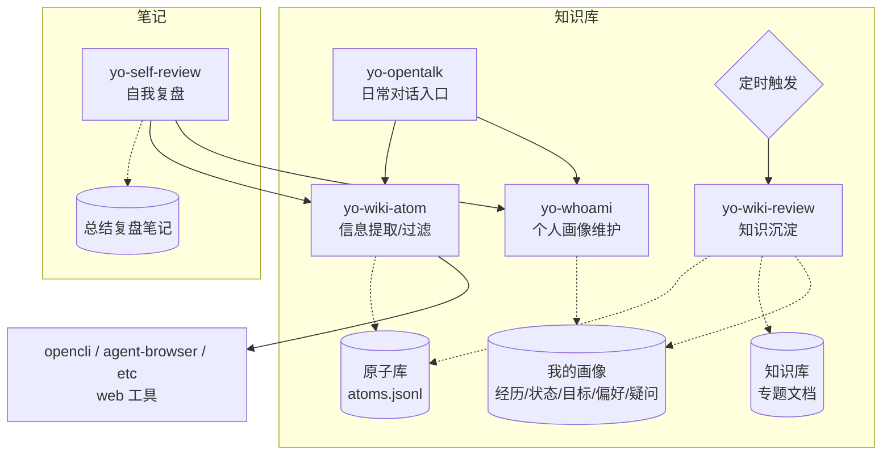

<div align="center">
<h1>Yolanda Skills</h1>
<p>Yolanda 日常使用的 AI Agent Skill 集合——涵盖知识管理、浏览器自动化、生活工具。<br>每个 skill 模块独立、按需取用。附带可直接复刻的<strong>知识库模板</strong>。</p>
</div>

## 能力地图

### 知识管理
> 基于 Obsidian部署的本地知识库，配合知识库模板

| Skill | 功能 | 环境依赖 | 依赖其他 Skill |
|-------|------|----------|---------------|
| `yo-opentalk` | 日常对话/问答/头脑风暴入口，自动路由到合适的下游 skill | `WIKI_DIR` | `yo-wiki-atom`、`yo-whoami` |
| `yo-wiki-atom` | 从链接/文本中提取知识原子，写入原子库。内容获取可借助 `opencli` / `agent-browser` | `WIKI_DIR` | （推荐搭配 `opencli`、`agent-browser`） |
| `yo-wiki-review` | 定期扫描原子库，提炼为结构化知识专题 | `WIKI_DIR` | — |
| `yo-whoami` | 维护个人画像——经历、当前状态、目标、偏好、疑问 | `WIKI_DIR` | — |

> 知识库模块的完整安装方式、内部依赖关系和工作流详见 [知识库专题](#知识库专题)。

### 浏览器自动化

| Skill | 功能 | 环境依赖 | 依赖其他 Skill |
|-------|------|----------|---------------|
| `opencli` | 浏览器/Electron CLI 控制，复用 cookie，针对特定站点优化 | `CHROME_PROFILE_DIR`、Chrome、`opencli` CLI | — |
| `agent-browser` | 通用浏览器自动化 CLI，页面导航、表单填写、截图等 | Chrome、`agent-browser` CLI | — |

### 生活工具

| Skill | 功能 | 环境依赖 | 依赖其他 Skill |
|-------|------|----------|---------------|
| `yo-utils-music` | 基于偏好控制网易云音乐播放（切歌、搜索、清空列表等） | `opencli` CLI | `opencli` |

> 音乐偏好存于 `$YO_CONFIG_HOME/music.md`。

### 笔记与复盘

| Skill | 功能 | 环境依赖 | 依赖其他 Skill |
|-------|------|----------|---------------|
| `yo-self-review` | 日/周复盘，校准判断力；可将洞察传递至知识库系统 | `NOTES_DIR` | `yo-wiki-atom`（可选）、`yo-whoami`（可选） |

> 📚 `yo-self-review` 最佳搭配知识库模块使用，但**可独立运行**——只设置 `NOTES_DIR` 即可。

### 已废弃

| Skill | 原用途 | 替代方案 |
|-------|--------|----------|
| `yo-code-simplify` | 代码简化 | 使用 Claude Code 内置 `/simplify` |
| `yo-learn-wiki` | 知识学习 | 拆分为 `yo-opentalk` + `yo-wiki-atom` + `yo-wiki-review` |
| `yo-utils-url` | URL 采集 | 由 `opencli` + `agent-browser` 覆盖 |
| `yo-code-readme` | 项目 README 生成 | 使用 Claude Code 通用能力或 `skill-creator` |

---

## 如何部署

### 安装 Skill

使用 `npx skills add` 一键安装：

```bash
npx skills add github:that-yolanda/yolanda-skills
```

也可以直接 clone 仓库，将需要的 `skills/<name>` 目录复制到 agent 的 skills 路径（如 `~/.claude/skills/`）。每个 skill 目录自包含，复制即生效。

### 部署知识库

如果你需要知识管理功能（`yo-opentalk` / `yo-wiki-atom` / `yo-wiki-review` / `yo-whoami`），除了安装 skill 外，还需要初始化知识库模板和环境变量。详见 [知识库专题 - 初始化知识库](#初始化知识库)。

---

## 如何使用

按你想做的事找到对应 skill，直接对 agent 说：

| 我想… | 使用 | 示例指令 |
|--------|------|----------|
| 日常聊天、头脑风暴 | `yo-opentalk` | （自由对话，自动路由） |
| 总结文章/视频，记录要点 | `yo-wiki-atom` | 「帮我总结这篇文章，记录到知识库」 |
| 定期整理知识，形成专题 | `yo-wiki-review` | 「帮我整理本周新增的原子」 |
| 记录/查看关于我的信息 | `yo-whoami` | 「更新我的偏好」「我最近在学什么？」 |
| 做每日/每周复盘 | `yo-self-review` | 「这是今天总结 @总结的文件.md, 帮我复盘」 |
| 浏览器自动化操作 | `opencli` / `agent-browser` | 「帮我把这个页面内容提取出来」「小红书/twitter 上帮我调研下类似需求, 需求如下：...」 |
| 切歌/控制网易云音乐 | `yo-utils-music` | 「给我来点背景乐」「给我推荐点歌」 |

> 💡 知识库功能的完整使用流程（信息输入 → 原子提取 → 知识沉淀 → 画像更新）见 [知识库专题](#知识库专题)。

---

## 知识库专题

知识库是本仓库中的一个应用模块，由 **4 个 skill + 模板 + 示例脚本** 协同工作。



### 概述

知识库的核心设计理念：**知识库的一等公民是 Agent，不是人。**

人只管输入和消费，Agent 负责过滤、归类、沉淀。三条设计原则：

- **原子化** — 所有信息拆解为最小的可复用单元（原则、方法、案例、反模式、工具、洞察）
- **可过滤** — 每条信息入库前经过价值判断：「这条内容下个月还能不能复用？」临时的和低价值的直接丢弃
- **可迭代** — 定期由 Agent 整理原子、提炼专题，同时更新个人画像，形成「信息输入 → 过滤 → 沉淀 → 自我认知更新」的闭环

### 知识库结构

```
知识库根目录（WIKI_DIR）
├── 原子库/           # [原始信息碎片] 经过过滤/提取的信息碎片
│   ├── atoms.jsonl   #   每行一条原子（JSONL 格式，脚本操作，避免 agent 直接改）
│   └── 使用说明.md    #   读写规范，agent 操作前必读
├── 资料库/           # [原始资料] 信息提取时保存的高价值原始资料
│   └── 使用说明.md
├── 知识库/           # [沉淀内容] 从原子库提炼、结构化的知识专题
│   └── 使用说明.md
├── 我的画像/         # [用户信息] 关于你的记录
│   ├── 我的经历       #   过去的重要经历
│   ├── 我的当前状态    #   正在做的事、当前角色
│   ├── 我的目标       #   短期/长期目标
│   ├── 我的偏好       #   工具、习惯、生活方式等偏好
│   ├── 我的疑问       #   待探索的问题
│   └── 使用说明.md
└── 使用说明.md        # 根级规范，所有 agent 操作前先读
```

**核心原则**：每个目录的 `使用说明.md` 是该目录的入口/索引/规范。Agent 每次读写对应目录前，**强制要求先读取该文件**。

### 常见工作流

#### 信息输入

**触发**：手动发送链接/文本给 agent，要求「帮我总结并记录」。

```
用户调用 yo-opentalk → 意图识别
  ↓
交给 yo-wiki-atom 读取内容 →（web_fetch / opencli / agent-browser）
  ↓
评估内容价值 → 过滤 → 提取关键信息
  ↓
生成知识原子 → 原子库/atoms.jsonl
（可选，有价值时）保存原始资料 → 资料库/
```

#### 知识沉淀

**触发**：定期（每周/积累一定量原子后）手动或定时触发。

```
触发 yo-wiki-review
  ↓
扫描 原子库/atoms.jsonl 中未处理/新原子
  ↓
将相关原子归类、合并 → 提炼为结构化专题
  ↓
写入 知识库/<专题目录>/
回写原子 status 为「已处理」
  ↓
（可选）更新 我的画像 中的洞察
```

#### 自我复盘 + 知识闭环

**触发**：每日/每周复盘时。

```
触发 yo-self-review（NOTES_DIR 下生成/更新复盘日志）
  ↓
复盘过程中发现的洞察
  ├→ 调用 yo-wiki-atom → 写入 原子库/
  └→ 调用 yo-whoami → 更新 我的画像（状态/目标变化）
```

### 初始化知识库

#### 用户操作（告诉 agent）

```
帮我初始化知识库，模板在这里：https://github.com/that-yolanda/yolanda-skills
```

agent 会询问知识库存放目录、复制模板结构、配置 `WIKI_DIR` 环境变量。

#### Agent 操作步骤

> 以下是你（AI Agent）为用户初始化知识库时需要执行的步骤。

1. **确认路径**：用 AskUserQuestion 询问用户知识库存放目录，按用户平台推荐合适的默认路径
2. **获取模板**：clone 仓库到临时目录
   ```bash
   git clone https://github.com/that-yolanda/yolanda-skills <temp-dir>
   ```
3. **复制模板**：
   ```bash
   cp -r <temp-dir>/知识库模板/ <用户指定的目录>
   ```
4. **配置环境变量**：首先写入 config.env，然后按平台使 `WIKI_DIR` 生效（持久化 + 即时可用）。具体命令见 [配置机制 — 环境变量生效步骤](#环境变量生效步骤)。完成后执行 `echo $WIKI_DIR` 确认输出正确路径
5. **验证**：确认目录结构完整、`echo $WIKI_DIR` 输出正确路径
6. **告知用户**：
   ```
   知识库已初始化！你现在可以对我说：
   - 「帮我总结这篇文章，记录到知识库」
   - 「帮我整理本周新增的原子」
   - 「更新我的偏好」
   ```

#### 配置 `yo wiki` 命令

`yo-wiki-atom` / `yo-wiki-review` 通过 `yo wiki` 命令读写 `atoms.jsonl`（禁止直接编辑 JSONL），因此 **`yo` 命令必须可用**，否则这两个 skill 无法工作。

仓库提供 `examples/yo.mjs` 作为参考实现（Node.js，无外部依赖）：可直接使用，也可作为模板按自身需求改写或整体替换——只要遵循同一命令协议（`yo wiki search/add/update`，参数见 `yo wiki -h`）。数据量到几万条脚本完全够用，量更大可自行切换到数据库。

macOS/Linux：把下面的 `yo()` 函数加到当前 shell 的启动文件（如 zsh 的 `~/.zshenv`），路径替换为仓库实际位置：

```bash
yo() {
  node "/path/to/yolanda-skills/examples/yo.mjs" "$@"
}
```

Windows：由 agent 按本机环境适配等效入口（如 doskey 或 PowerShell function）。

---

## 配置机制

所有 skill 配置和数据统一存放路径 `YO_CONFIG_HOME`，配置：`$YO_CONFIG_HOME/config.env`。

| 变量 | 用途 | 使用方 |
|------|------|--------|
| `WIKI_DIR` | 知识库 vault 根 | yo-opentalk / yo-whoami / yo-wiki-atom / yo-wiki-review |
| `NOTES_DIR` | 笔记/复盘根 | yo-self-review |
| `DAILY_NOTE_PATH` | 每日日志路径模板 | yo-self-review |
| `WEEKLY_NOTE_PATH` | 每周日志路径模板 | yo-self-review |
| `CHROME_PROFILE_DIR` | 隔离 Chrome profile | opencli |

`YO_CONFIG_HOME` 默认值：

| 平台 | 路径 |
|------|------|
| macOS / Linux | `~/.local/share/yo` |
| Windows | `%LOCALAPPDATA%\yo` |

用户可自定义 `YO_CONFIG_HOME` 覆盖默认。**所有配置由 agent 在首次使用时引导完成**，用户无需手动编辑。

### 环境变量生效步骤

> 以下为 agent 为用户配置环境变量时的操作步骤。目标是：当前 session 即时可用 + 未来新 session 自动加载。

#### macOS / Linux

写入当前 shell 的启动文件（如 zsh 的 `~/.zshenv`），已有则跳过：

```bash
export YO_CONFIG_HOME="${YO_CONFIG_HOME:-$HOME/.local/share/yo}"
[ -f "$YO_CONFIG_HOME/config.env" ] && set -a && . "$YO_CONFIG_HOME/config.env" && set +a
```

当前 session 即时 `source` 该文件，`echo $WIKI_DIR` 验证。

#### Windows

`setx` 持久化（新进程自动继承）+ `set`/`$env:` 当前窗口即时生效：

```cmd
setx YO_CONFIG_HOME "%LOCALAPPDATA%\yo"
setx WIKI_DIR "<路径>"
set WIKI_DIR=<路径>
echo %WIKI_DIR%
```

各 skill 的具体配置步骤见其 `references/first-time-setup.md`。

---

## 目录结构

```
.claude/          # Claude Code 配置
skills/           # 所有 skill（每个含 SKILL.md + README.md，可选 references/）
知识库模板/    # 知识库框架（clone 即用，无个人数据）
examples/         # 示例脚本（yo wiki CLI）
.env.example      # 环境变量清单模板
README.md         # 本文件
CLAUDE.md         # 开发约定
```

---

## 协议

[MIT](LICENSE)
