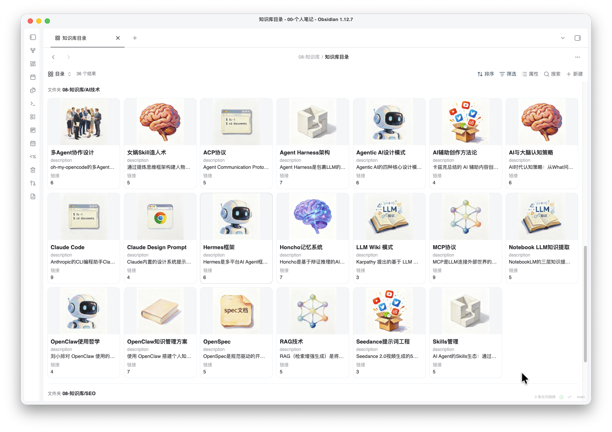
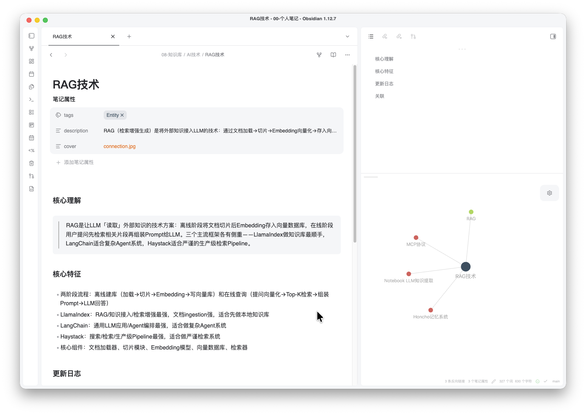

<div align="center">
<h1>Yolanda Skills</h1>
个人日常在使用的 Skills 合集，覆盖代码审查、知识库管理、内容采集等场景。支持 Claude Code / Codex / Hermes 等 Agent。
</div>

## 组合应用
### Obsidian 知识库
使用 skill: [yo-utils-url](#yo-utils-url) 采集 + [yo-learn-wiki](#yo-learn-wiki) 知识库整理

**效果展示**



## SKILL目录

| Skill                                                | 类型    | 说明                                                      | 依赖环境                                                                                     |
| ---------------------------------------------------- | ----- | ------------------------------------------------------- | ---------------------------------------------------------------------------------------- |
| [yo-learn-wiki](#yo-learn-wiki)       | Learn | 基于 Obsidian 的人类可读的知识库，自动生成基于  Obsidian base数据库的可视化知识库目录 | [bun](https://bun.com/), obsidian cli, chrome                                            |
| [yo-utils-url](#yo-utils-url)         | Utils | 提取 URL 内容保存到 Obsidian 中（微信公众号、Twitter/X、YouTube、任意网页）   | node, [bun](https://bun.com/) [@jackwener/opencli](https://github.com/jackwener/OpenCLI) |
| [yo-code-readme](#yo-code-readme)     | Code  | 创建或更新项目 README.md                                       | -                                                                                        |
| [yo-code-simplify](#yo-code-simplify) | Code  | 代码可读性与复杂度审核                                             | -                                                                                        |

命名规范：`yo-<分类>-<功能>`

## 告诉 AI AGENT 快速安装

告诉你的 AI：
```
安装这些 skill：https://github.com/that-yolanda/yolanda-skills
```

或指定单个 skill：
```
帮我安装 https://github.com/that-yolanda/yolanda-skills 里的 yo-utils-url skill
```

## 手动安装

### yo-utils-url

提取 URL 内容为 Markdown。支持微信公众号、Twitter/X、YouTube、任意网页。自动下载图片/视频等资源，输出为 Obsidian 兼容的 Markdown 文件。

**准备环境**
- 安装 [bun](https://bun.com/) 环境
```zsh
# mac / linux
curl -fsSL https://bun.sh/install | bash

# windows
powershell -c "irm bun.sh/install.ps1 | iex"
```
- 确保 Chrome 存在
- 安装 [opencli](https://github.com/jackwener/OpenCLI) 并配置安装Chrome 的 Browser Bridge 扩展插件 [指导](https://github.com/jackwener/OpenCLI#2-install-the-browser-bridge-extension)  （这步在后续 skill 初次执行时也会引导安装，可选择复用用户 chrome profile 或 创建隔离环境，避免影响用户个人chrome 账号）
```zsh
# 检查node版本，要求 Node.js >= 21
node --version
# 安装opencli
npm install -g @jackwener/opencli

# 后续升级
npm install -g @jackwener/opencli@latest
```

**安装**

```zsh
npx skills add github:that-yolanda/yolanda-skills --skill yo-utils-url
```

**使用**

初次使用
```markdown
/yo-utils-url 初始化
```

后续采集
```markdown
/yo-utils-url https://mp.weixin.qq.com/s/xxxxx
```

### yo-learn-wiki

基于 Obsidian 的人类可读的知识库，自动生成基于  Obsidian base数据库的可视化知识库目录，构建个人知识图谱。

**准备环境**
- 确保已安装 [Obsidian](https://obsidian.md/)
- 启用obsidian-cli：进入 Obsidian → 设置 → 关于 → 命令行界面
- 安装 [bun](https://bun.com/) 环境
```zsh
# mac / linux
curl -fsSL https://bun.sh/install | bash

# windows
powershell -c "irm bun.sh/install.ps1 | iex"
```

**安装**
```zsh
npx skills add github:that-yolanda/yolanda-skills --skill yo-learn-wiki
```


**使用**
```markdown
/yo-learn-wiki 初始化
```

```markdown
整理这篇笔记到知识库：03-文章/AI/某篇文章.md
```

```markdown
检查知识库健康状态
```

### yo-code-readme

扫描项目结构、配置文件和源码，生成或更新 README。无额外依赖。

**安装**
```zsh
npx skills add github:that-yolanda/yolanda-skills --skill yo-code-readme
```

**使用**
```markdown
帮我生成 README
```

```markdown
更新项目 README，重点补充安装步骤
```

### yo-code-simplify

审查代码中的过度设计、冗余抽象和不必要的复杂度，给出简化建议。无额外依赖。

**安装**

```zsh
npx skills add github:that-yolanda/yolanda-skills --skill yo-code-simplify
```


**使用**

```markdown
审查 src/utils 目录的代码复杂度
```

```markdown
简化这个 PR 中的过度抽象
```


## 协议

MIT License